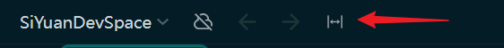
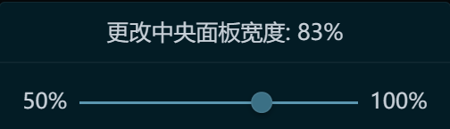
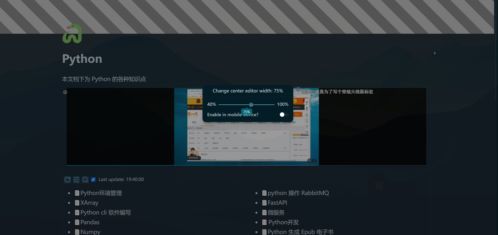

- Please turn off 'adaptive width', i.e. full width mode, before using
- The configuration for each device is independent and needs to be set separately

## Basic usage

- Click on Icon to bring up a dialog

  

- Drag the slider to adjust the width

  

  You may find that it gets stuck when dragging, if you don't like it, you can use the left and right keyboards to fine tune it

- Title, editor content, iframe, widget

- Press `Alt+[-=]` to decrease/increase width

## Two width modes

- Percentage mode: in `%` units
- Fixed width mode: in pixels

## Main Editor and Small Window

- Set SiYuan's main editor's and mini-window's widths separately.
- The width of the small window is fixed in percentage mode, without the fixed width mode.

## Two Running Modes

- Simple Mode: CSS Styling Only

  - Pros: Very lightweight, minimal performance impact.
  - Cons: Does not apply to iframes and widgets.

- Complex Mode: CSS + JS

  - Pros: Applies to iframes and widgets.
  - Cons: Higher performance overhead.
