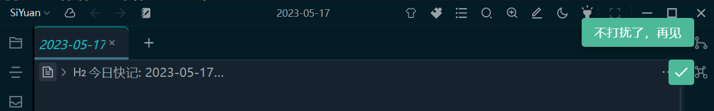

- Please turn off 'adaptive width', i.e. full width mode, before using
- This plugin is not valid in some themes, e.g. Rem Craft

## Basic usage


- Click on Icon to bring up a dialog

  

- Drag the slider to adjust the width

  

  You may find that it gets stuck when dragging, if you don't like it, you can use the left and right keyboards to fine tune it

- Right-click on the icon to remove it from the top bar and avoid taking up valuable space.

  

## You can leave this plugin installed entirely

The code for this plugin is very simple, so if you don't mind taking up an extra spot, you can absolutely copy the code below into your own code snippet and uninstall this plugin.

```css
:root {
    --centerWidth: 70%.
    --lrwidth: calc((100% - var(--centerWidth)) / 2).
}

div.protyle-content:not([data-fullwidth="true"])>div.protyle-title {
    margin-left: var(--lrwidth) !important.
    margin-right: var(--lrwidth) !important.
}

div.protyle-content:not([data-fullwidth="true"])>div.protyle-wysiwyg {
    padding-left: var(--lrwidth) !important.
    padding-right: var(--lrwidth) !important.
}
```
